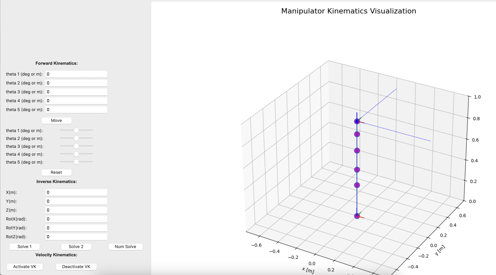
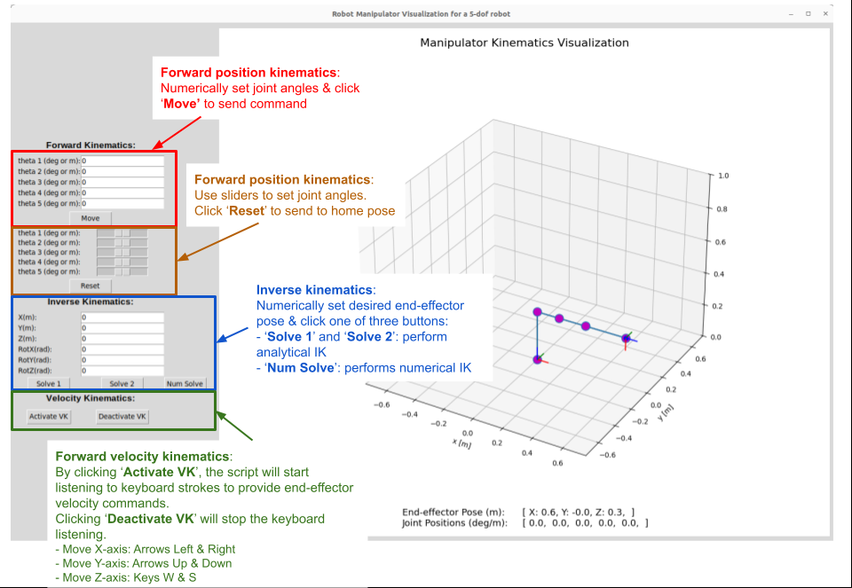

# Forward Position and Velocity Kinematics Simulation for 5-dof Arm

## Viz Tool
This part of Mini-Project 1 involved implementing forward position and velocity kinematics in a simulator. We used a homogeneous transformation matrix (HTM) derived from a Denavit-Hartenberg (DH) table in order to implement the position kinematics. We then found the Jacobian matrix from the HTM and used it to implement RRMC control for our forward velocity kinematics. 


## Setting up your PC

#### Step 0 (Optional): Install VScode
- Install Visual Studio Code using [these instructions](https://code.visualstudio.com/download)


#### Step 1: Install Python 3 (if not already installed)
- First, check if you have Python3, to do that, open your terminal and type:
```bash
$ python3 --version     # <--- type this
Python 3.10.12          # <--- you should see something like this
```
- If you don’t have Python installed, follow this [tutorial here](https://realpython.com/installing-python/) to install it.


#### Step 2: Create a virtual environment
- Follow this [tutorial here](https://docs.python.org/3/tutorial/venv.html).


#### Step 3: Get this repository from Github
- Follow [this tutorial](https://ftc-docs.firstinspires.org/en/latest/programming_resources/tutorial_specific/android_studio/fork_and_clone_github_repository/Fork-and-Clone-From-GitHub.html) to fork and clone the repository.


#### Step 4: Install all required Python packages
- Activate the virtual environment you created in step 2. 
- cd into the project folder

```bash
$ cd arm-kinematics-module
```
- Next, install all required packages from requirements.txt
```bash
$ pip install -r requirements.txt
```


### How to Run

- If setup worked well, you should be able to run the main script with the command below:
``` bash
$ python main_arm.py 
# this configures the two-DOF arm
```

- For this project, you will need to pass a command-line argument to configure the viz tool to be a 5-dof arm.

```bash
$ python main_arm.py --robot_type 5-dof
```

### Usage Guide
For this project, only the red, orange, and green boxes are used. 
