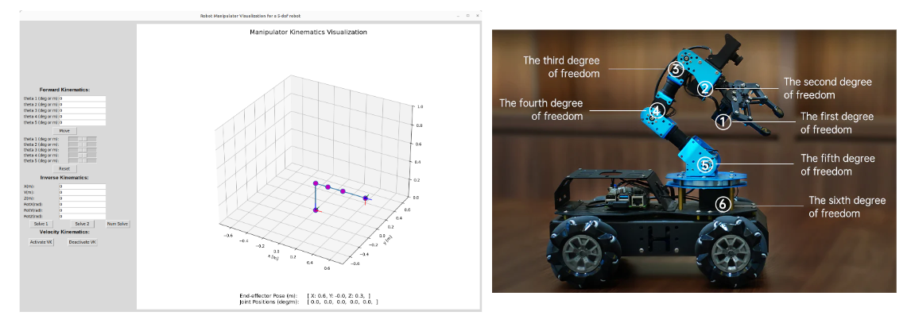

# Mini-Project 2: Inverse Kinematics

## Overview
This mini-project has the following goals:
- TBD

This assignment will count towards your **final course grade**. It is a team-based assignment with 2-3 students in a team.

## What to Do

1. TBD

## What to Submit

A **PDF submission** with the following:
- Derivation of the closed-form IK equations for the 5DOF robot platform
- Derivation of the jacobian matrix and inverse jacobian matrix for the robot arm for use in the numerical IK solver
- Code showing all the functions you implemented
- Link to a screenshot video showing your verification using the viz tool for both analytical and numerical IK solvers
- Link to a video showing physical robot reaching commanded positions in the workspace
- Link to your team's Github repository with a reasonably setup README
- **Individual reflections** on the following questions:
    - What did you learn from this? What did you not know before this assignment?
    - What was the most difficult aspect of the assignment?
    - What was the easiest or most straightforward aspect of the assignment?
    - How long did this assignment take? What took the most time (PC setup? Coding in Python? Exploring the questions?)?
    - What did you learn about arm inverse kinematics that we didn't explicitly cover in class?
    - What more would you like to learn about arm inverse kinematics?

