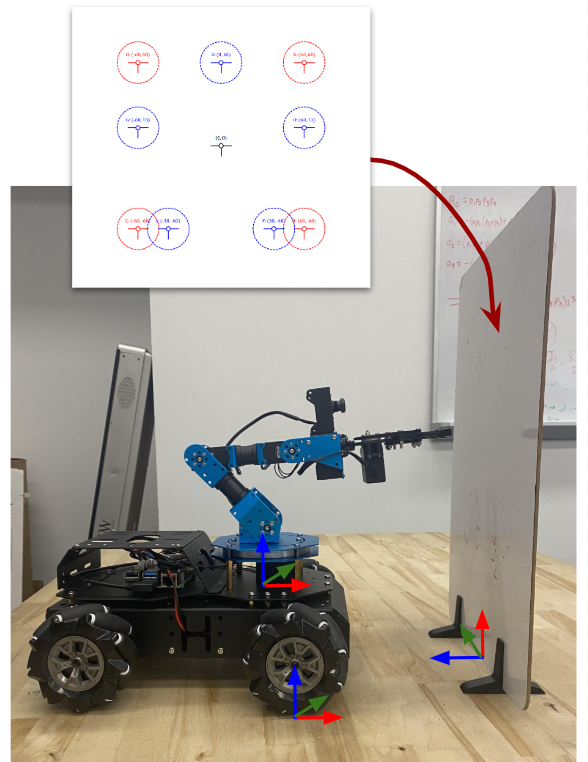

# Mini-Project 2: Inverse Kinematics

## Overview
This mini-project aims to:
- Provide intuition about inverse kinematics operations for robot manipulators.
- Practice deriving and applying analytical and numerical inverse kinematics algorithms for robot manipulators.
- Develop your proficiency in Python programming for robotics applications.

This assignment will count towards your **final course grade**. It is a team-based assignment with 2-3 students in a team.

## What to Do

**Problem 1 (Analytical IK)**
- Derive the analytical IK equations for the 5DOF robot
- Implement the analytical IK equations in the Viz tool and demonstrate the different solutions

**Problem 2 (Numerical IK)**
- Define the numerical IK algorithm for the 5DOF robot
- Implement the numerical IK algorithm in the Viz tool 

**Problem 3 (Hardware Implementation)**
- Implement both analytical and numerical IK on the 5DOF robot hardware
- Compare the results and report your observations

**Problem 4 (Cartesian Path Following Demo)**
- Implement a simple cartesian path following algorithm and demonstrate with: (1) tracing out our given shapes ([**download here**](https://github.com/OlinCollege-FunRobo/arm-kinematics-module/blob/main/resources/Mini-Project%202%20Target%20V1.pdf)), (2) tracing out a word (e.g., "A", "N", "T") - define waypoints to achieve your letters.

 

## What to Submit

A **PDF submission** with the following:
- Derivation of the analytical IK equations for the 5DOF robot platform (show your working)
- Description of your process for computing the jacobian and inverse jacobian matrices for use in the numerical IK solver (similar to Mini-project 1)
- Code showing all the functions you implemented
- Link to a screenshot videos showing your verification using the viz tool for both analytical and numerical IK solvers
- Report on the results and your observations from comparing your analytical and numerical IK solvers
- Link to a video showing physical robot tracing out the given shapes
- Link to a video showing physical robot tracing out your custom WORD
- Link to your team's Github repository with a reasonably setup README
- **Individual reflections** on the following questions:
    - What did you learn from this? What did you not know before this assignment?
    - What was the most difficult aspect of the assignment?
    - What was the easiest or most straightforward aspect of the assignment?
    - How long did this assignment take? What took the most time (PC setup? Coding in Python? Exploring the questions?)?
    - What did you learn about arm inverse kinematics that we didn't explicitly cover in class?
    - What more would you like to learn about arm inverse kinematics?

