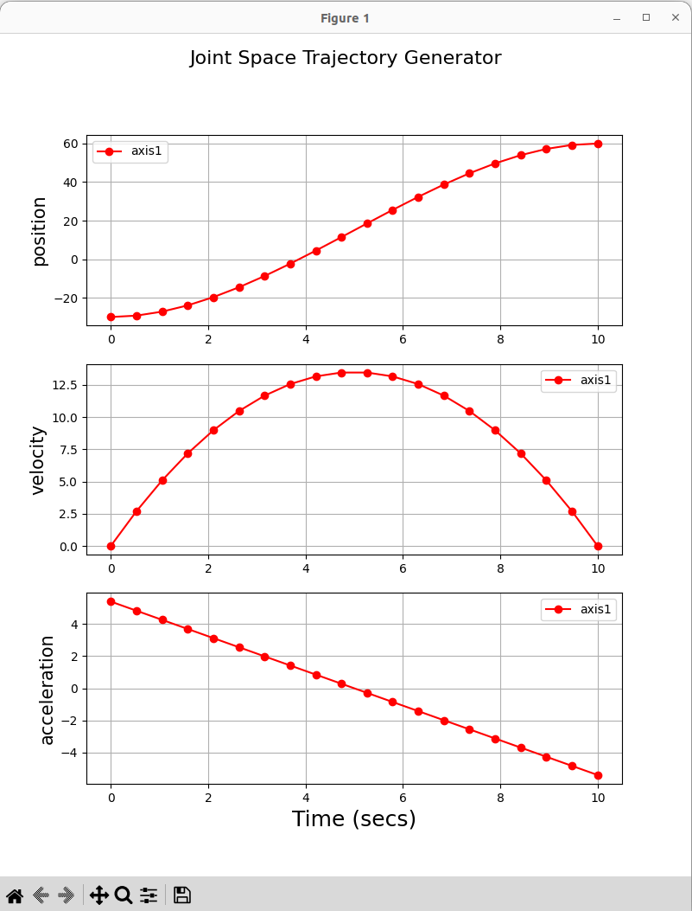
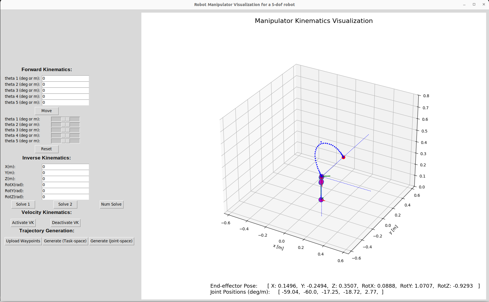

# Module 3: Trajectory Generation for Robot Manipulators

This repository accompanies the class activities in modules 3 focusing on different approaches for generating smooth, feasible trajectories for robot manipulators.

This repository utilizes the **visualization tool (viz tool)** presented earlier in the course, with a few additions and modifications.

<!-- ## Viz Tool -->

<!--  -->

## Setting up your PC

To use the tool, please make sure you have set up your PC following [the instructions here](https://github.com/OlinCollege-FunRobo/arm-kinematics-module?tab=readme-ov-file#setting-up-your-pc)


## How to Run

### Run Trajectory Generator alone
- You can test your trajectory generator implementation by setting parameters in `main_traj.py` and running it as below
``` bash
$ python main_traj.py 
```



### Run Viz tool with the trajectory generation

- To run the main viz tool with the trajectory generation component, run the main code as usual:

``` bash
$ python main_arm.py -h

usage: main_arm.py [-h] [--robot_type ROBOT_TYPE] 

options:
  -h, --help            show this help message and exit
  --robot_type ROBOT_TYPE
                        insert robot type, e.g., '2-dof', 'scara', '5-dof'
```
- Example, for 5-DOF robot:
```bash
$ python main_arm.py --robot_type 5-dof
```




## Generative AI Use Disclosure
- Please make sure to briefly describe what and how generative AI tools were used in developing the contents of your work.
- Acceptable use:
    - To research a related topic to the subject at hand
    - As a substitute to "Stackoverflow" guides on quick programming how-tos, etc.
- Unacceptable use:
    - Directly copying large swaths of code from a ChatGPT response to a prompt in part or entirely related to the assignment's problem

For example, I used ChatGPT to generate docstrings for the functions in this repository, suggest refactoring ideas, and help identify bugs in the code.

