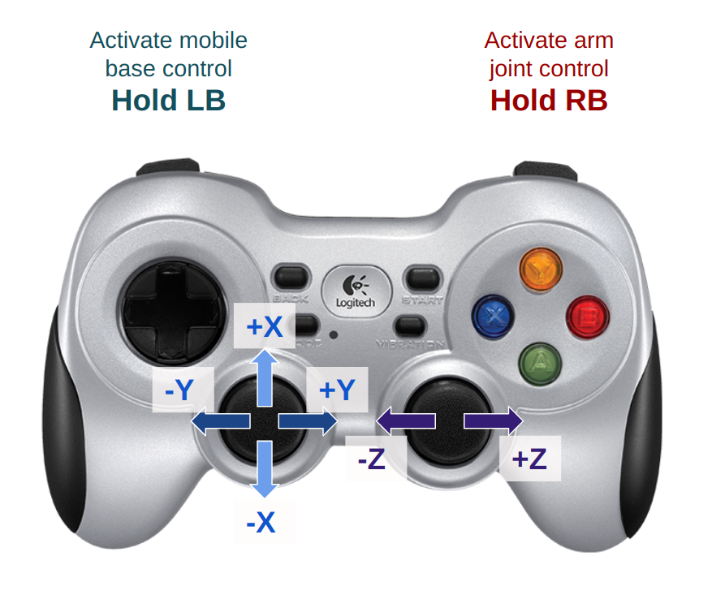

# User Inputs for Controlling the Robot (Viz and Hardware)

## Keyboard Mapping

When using the Viz tool in the **velocity kinematics (FVK)** mode, please use the following key mapping to move the robot end-effector.

 

## Gamepad Mapping

When working on the robot hardware, please use the gamepad to control the end-effector velocity in the **velocity kinematics (FVK)** mode. Please use the following button mappings.

 

